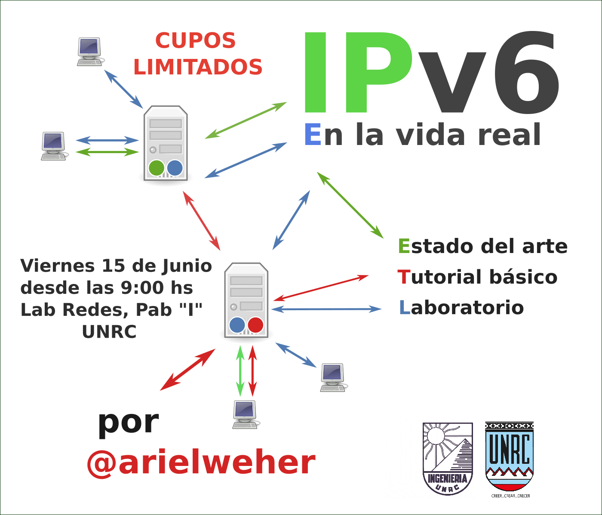

# IPv6 en la vida real

Cursos de Actualización, especialización y perfeccionamiento sobre la versión 6 del Protocolo de Internet. Motivación, estado del arte, estándares, protocolos y buenas prácticas. Tutorial básico de planificación y enumeración de una red. Laboratorio experimental.

Res. Dec. N°

**CUPOS LIMITADOS**

# Sobre Ariel Weher

[Ariel](https://twitter.com/arielweher) es un experto en temas de internet, posee una cantidad significativa de certificaciones de redes de Cisco, Mikrotik, entre otros, se especializa en el diseño, administración e implementación de los más importantes protocolos, estándares y procedimientos de redes con un perfil ingenieril. Es uno de los referentes en el rubro en Argentina y Latinoamérica, reside en la ciudad de Rosario.

En esta ocasión se dispone a impartir una jornada de capacitación **sin costo** en la Universidad Nacional de Río Cuarto.

# ¿Cuándo y dónde?

El taller de capacitación sobre IPv6 se realiza el **Viernes 1° de Junio de 2018 a partir de las  9hs**,

en las instalaciones del **Laboratorio de Redes en el [Pab "I"](https://www.openstreetmap.org/way/220547523#map=19/-33.11160/-64.29857) de la Fac. de Ingeniería** de la UNRC.

# ¿A quién está dirigido?

Alumnos, egresados, docentes o no docentes de la UNRC, profesionales del rubro de las redes de computadoras.

### Conocimientos previos

* Fundamentos básicos de redes de computadoras.
* IPv4, DNS, configuración de interfaces de red.
* Manejo básico de distribuciones GNU/Linux.

# Cronograma

**9:00 - 10:30** “IPv6 en la vida real”, introducción, motivación, estado del arte.

**10:30 - 11:00** *Break*.

**11:00 - 13:00** Tutorial básico de redes e IPv6.

**13:00 - 14:00** *Almuerzo.*

**14:00 - 17:00** Laboratorio experimental con redes reales.

# Contenidos

* **Introducción y motivación**
	* ¿Qué es internet?
    * Estado del arte de las redes, su diseño, administración y gestión
    * ¿Por qué es importante el estudio de los estándares, procedimientos y buenas prácticas del diseño, administración y gestión de redes?
    * ¿Por dónde empezar?
    * ¿Qué aspectos tener en cuenta en la toma de decisiones?
* **Conceptos iniciales**
	* RIRs
	* Protocolos que (realmente) hacen andar internet
	* BGP, Sistemas autónomos, NRLI, AFI, SAFI, DNS.
	* IETF: 6man, v6ops
* **Estado de los protocolos**
	* IPv4, Fase 3 y política de "Soft landing"
	* IPv6, Estado de madurez. Estado de implementación del protocolo a nivel mundial
* **Grupos de trabajo regionales**: ARnog, LACNOG.
* **Descripción de componentes básicos de IPv6.**,Comparación entre encabezados de v4 y v6. Esquema de direccionamiento. Prácticas de direccionamiento ICMPv6, NDP, RA, MLD
* **Métodos de configuración de interfaces.** Manual. SLAAC. EUI-64. DHCPv6. Sin Estado. Con Estado
* **Descripción de algunos métodos de transición.** Dual Stack. DNS64/NAT64. 464XLAT. SIIT-DC
* **Tutorial básico.** Diseño de red. Enumeración. Confección de plan de ruteo. Sesión Telnet. Sesión SSH. Configuración manual de interfaces de red en GNU/Linux, Cisco y Mikrotik.
* **Laboratorio experimental** Planificación de red. Virtualización. Diseño. Enumeración. Confección de plan de ruteo. Configuración manual de interfaces. Implementación de protocolo de ruteo interno OSPF. Implementación de protocolo de ruteo externo BGP.

# Inscripción
**Formulario de inscripción:** [IPv6 en la vida real](https://goo.gl/forms/qxymPLU4S1wyONX52)

Se solicita nombre, apellido y DNI para la producción de certificados de asistencia y aprobación.

# Organización

*"IPv6 en la vida real"* está impulsado por alumnos y docentes de la carrera de Ing. en Telecomunicaciones de la UNRC.
